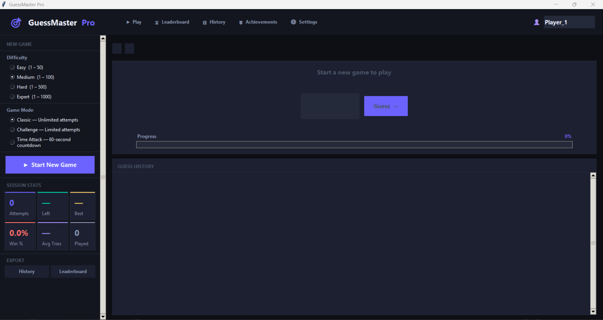
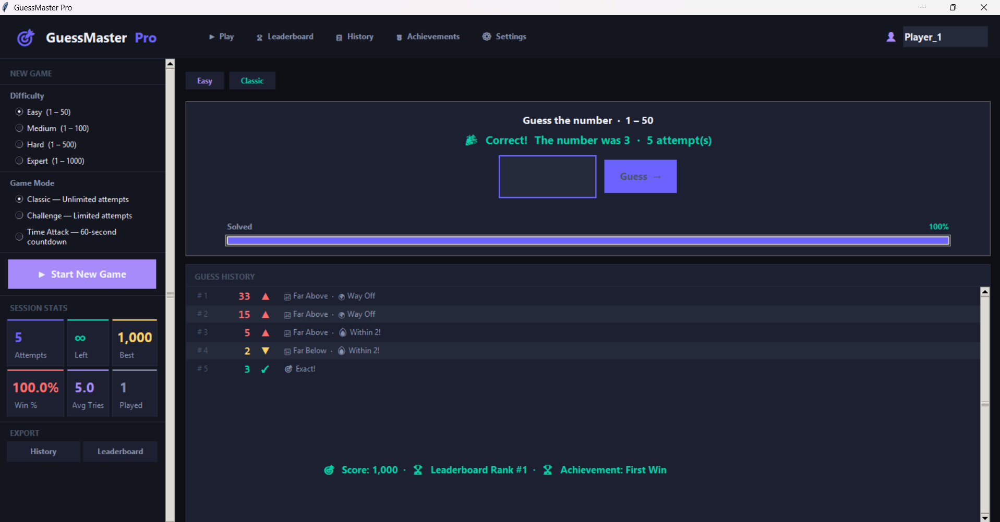
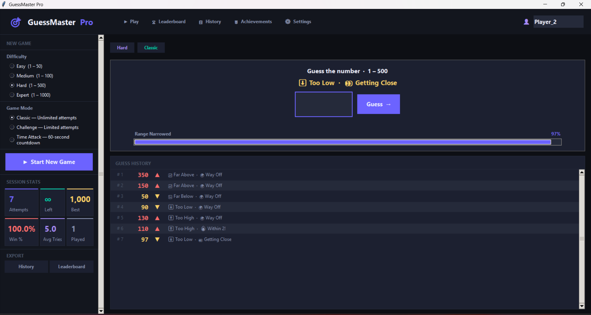
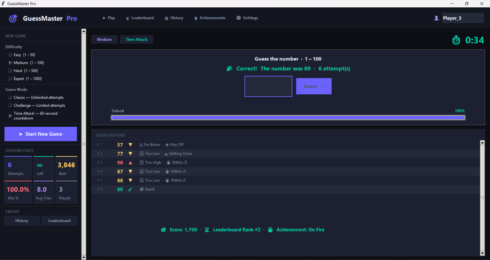
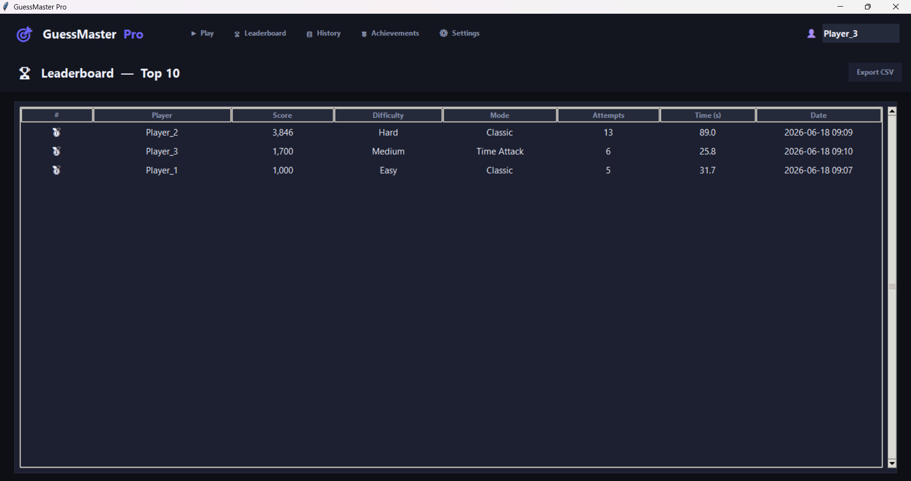
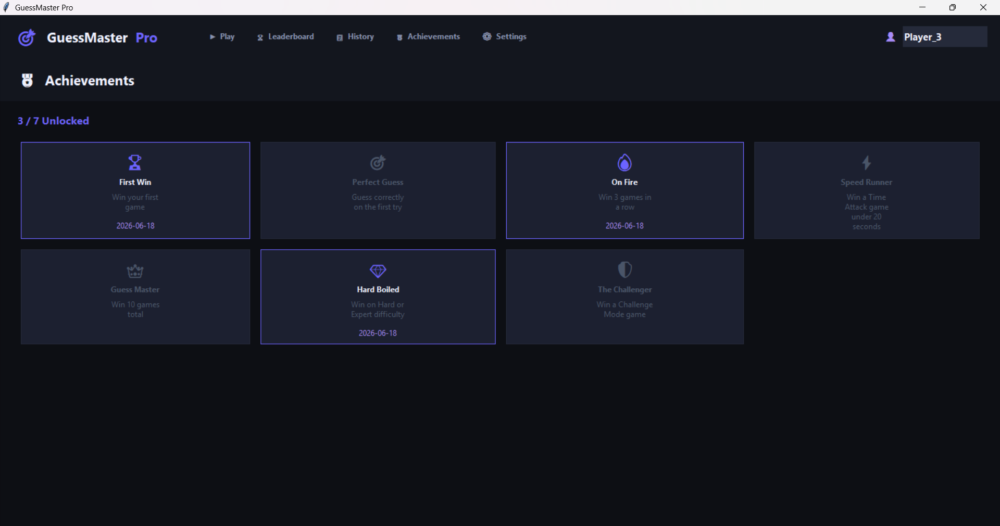

# 🎯 GuessMaster Pro


<p align="center">
  
  
  
  
  
</p>

> **A professional-grade number guessing game desktop application built with Python & Tkinter — featuring a dark-themed dashboard UI, multiple difficulty levels, three game modes, live analytics, a leaderboard system, achievements, and full data persistence.**

---

## ✨ Features

### 🎮 Game Modes
| Mode | Description |
|---|---|
| **Classic** | Unlimited attempts — pure skill |
| **Challenge** | Limited attempts based on difficulty |
| **Time Attack** | 60-second countdown, beat the clock |

### 📊 Difficulty Levels
| Level | Range | Challenge Attempts |
|---|---|---|
| Easy | 1 – 50 | 10 |
| Medium | 1 – 100 | 7 |
| Hard | 1 – 500 | 5 |
| Expert | 1 – 1000 | 3 |

### 🏆 Leaderboard
- Top 10 scores persisted across sessions (JSON)
- Filterable by difficulty and mode
- One-click CSV export

### 📈 Live Analytics Dashboard
- Attempts Used / Remaining
- Best Score · Win Rate · Average Attempts
- Current Win Streak · Games Played

### 💡 Smart Hint System
- `🎯 Exact!` → correct guess
- `🔥 Within 2!` → very close
- `⚡ Within 5!` → close
- `📍 Within 10!` → nearby
- `📈 Far Above / 📉 Far Below` → directional hints

### 🎖 Achievements
| Badge | Requirement |
|---|---|
| 🏆 First Win | Win your first game |
| 🎯 Perfect Guess | Guess correctly on attempt #1 |
| 🔥 On Fire | Win 3 games in a row |
| ⚡ Speed Runner | Win Time Attack in under 20 s |
| 👑 Guess Master | Win 10 games total |
| 💎 Hard Boiled | Win on Hard or Expert |
| 🛡 The Challenger | Win in Challenge Mode |

### 🌙 UI / Design
- Dark theme with electric violet accent palette
- Animated progress bars & stat cards
- Toast notifications for scores and achievements
- Fully responsive layout

---
## 🖼 Screenshots

### 🏠 Home Screen


### 🎯 Easy Mode Win


### 🔥 Hard Mode Gameplay


### 💡 Hint System


### ⏱ Time Attack Mode


### 🏆 Leaderboard


### 🎖 Achievements


---

## 🚀 Installation

### Prerequisites
- Python 3.9 or higher
- `tkinter` (included with standard Python on Windows/macOS; see below for Linux)

### Steps

```bash
# 1. Clone the repository
git clone https://github.com/your-username/GuessMaster-Pro.git
cd GuessMaster-Pro/PRODIGY_SD_02

# 2. (Optional) Create a virtual environment
python -m venv venv
source venv/bin/activate      # macOS/Linux
venv\Scripts\activate.bat     # Windows

# 3. No third-party dependencies — just run!
python main.py
```

#### Linux (if tkinter is missing)
```bash
sudo apt-get install python3-tk   # Debian/Ubuntu
sudo dnf install python3-tkinter  # Fedora
```

---

## 🗂 Project Structure

```
PRODIGY_SD_02/
├── main.py           # Entry point
├── game_engine.py    # Core game logic, hints, sessions, achievements
├── statistics.py     # Stats tracking + CSV export
├── leaderboard.py    # Top-10 leaderboard + CSV export
├── achievements.py   # Achievement unlock management
├── ui.py             # Full Tkinter GUI (all views, widgets, layout)
├── requirements.txt
├── README.md
└── LICENSE
└── Screenshots
```

---

## 🏗 Architecture

```
main.py
  └── GuessMasterApp (ui.py)
        ├── GameEngine      (game_engine.py)
        │     ├── GameSession
        │     ├── GuessResult
        │     └── Difficulty / GameMode / HintSystem
        ├── StatisticsManager  (statistics.py)
        ├── LeaderboardManager (leaderboard.py)
        └── AchievementManager (achievements.py)
```

- **GameEngine** is fully decoupled from the UI — pure Python logic
- **Managers** handle all persistence via JSON, with clean public APIs
- **UI** is composed of reusable widget helpers (`StatCard`, `GuessRow`, `AchievementBadge`, etc.)
- All data is saved automatically after each session

---

## 🔮 Future Improvements

- [ ] Sound effects using `pygame` or `winsound`
- [ ] Multiplayer mode over local network
- [ ] Animated number reveal on win
- [ ] Custom theme editor
- [ ] Statistics charts (matplotlib integration)
- [ ] Mobile port (Kivy or BeeWare)

---

## 👤 Author

**Your Name**
- GitHub: [@your-username](https://github.com/your-username)
- LinkedIn: [linkedin.com/in/your-profile](https://linkedin.com/in/your-profile)

Built as part of **Prodigy InfoTech Software Development Internship — Task 02**

---

## 📄 License

MIT License — see [LICENSE](LICENSE) for details.
